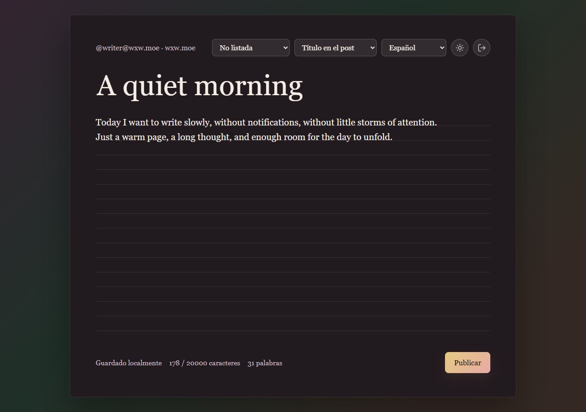

<p align="center">
  
</p>

# wxwmoe writer

A quiet, cozy, plain-text writing interface for publishing long-form posts to a Mastodon-compatible instance.

It was built for `wxw.moe`, but the backend uses the Mastodon API and can be configured for another instance.

<p align="center">
  
</p>

## Features

- OAuth login through Mastodon.
- Long-form, distraction-light editor with title and body fields.
- Plain text only.
- Local draft autosave.
- Character and word counters.
- Visibility selector.
- Title mode selector:
  - **Title in post** publishes the title as the first line.
  - **Title as content warning** sends the title as Mastodon's CW/spoiler text.
- Interface and post language selector for English, Spanish, and Chinese.
- Light and dark cozy themes.
- Publish button plus `Ctrl+Enter` / `Cmd+Enter`.
- Systemd service example for automatic startup after reboot.

## Configuration

The app is a small Python service with static HTML, CSS, and JavaScript.

Important environment variables:

```text
WXW_INSTANCE=https://wxw.moe
WXW_APP_NAME=wxwmoe writer
WXW_APP_WEBSITE=https://github.com/neura-neura/wxwmoe-writer
WXW_BASE_URL=http://your-lan-ip:18080
WXW_BASE_URLS=http://your-lan-ip:18080,http://your-vpn-ip:18080
WXW_APP_HOST=0.0.0.0
WXW_APP_PORT=18080
WXW_DATA_DIR=/opt/wxwmoe-writing/data
```

`WXW_BASE_URLS` can contain multiple callback origins, which is useful when the same server is reached through LAN and VPN addresses.

No server IPs are hardcoded. If `WXW_BASE_URL` and `WXW_BASE_URLS` are omitted, the app derives the callback origin from the incoming `Host` header. For a personal server, setting `WXW_BASE_URLS` explicitly is still recommended so OAuth registration is predictable.

## Run Locally

```bash
python3 server.py
```

Then open:

```text
http://127.0.0.1:18080/
```

## Systemd

An example unit is included in `wxwmoe-writing.service`.

After copying the project to `/opt/wxwmoe-writing`:

```bash
sudo cp wxwmoe-writing.service /etc/systemd/system/
sudo systemctl daemon-reload
sudo systemctl enable --now wxwmoe-writing.service
```

## Notes

The first login registers an OAuth application with the configured Mastodon instance. If `WXW_APP_NAME`, `WXW_APP_WEBSITE`, or the callback URLs change, the service registers a new OAuth application automatically.
